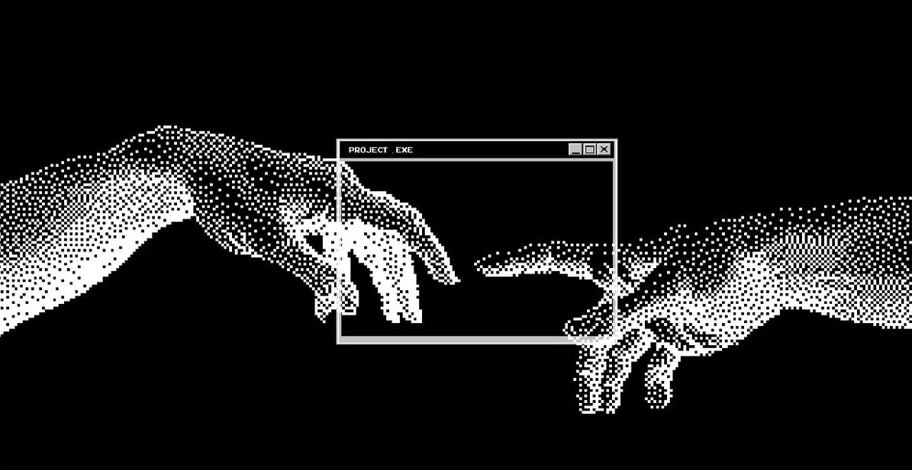

# Olá, eu sou o Guilherme 👋

**Desenvolvedor Full-Stack em formação** — construindo do backend em Java/Python ao frontend em JavaScript, com um pé forte em Linux e infraestrutura própria.

---

## 🧭 Sobre mim

Sou estudante de **Análise e Desenvolvimento de Sistemas** na Etec Bragança Paulista. Comecei programando por curiosidade com jogos, e hoje trabalho como freelancer em projetos web, migrando aos poucos para especialização em backend.

Uso **Arch Linux** como meu sistema operacional principal no dia a dia e mantenho um servidor doméstico para rodar meus próprios projetos de infraestrutura e IA local.

- 🔐 Aprofundando **Spring Boot** (JWT, Security, APIs REST)
- 🐍 Também trabalho com **Python/Flask** e **C#**
- 🖥️ Interesses: Cibersegurança, IA, Visão Computacional e Ciência de Dados

---

---

## 🛠️ Stack Atual

<h3 align="center">Backend</h3>

  
  
  
  

 

<h3 align="center">Frontend</h3>

  
  
  
  

 

<h3 align="center">Ferramentas & Infra</h3>

  
  
  
  

---

# 🚀 Projetos em destaque

### 📋 Task Manager API

Backend em Spring Boot com autenticação JWT e camada de segurança customizada, consumido por um frontend React/Vite.

`Java` `Spring Boot` `JWT` `React`

🔗 https://github.com/cavaleiro-olimpioo/taskManager

---

### 🤖 Miguel — Assistente de IA Local

Assistente estilo Jarvis rodando 100% em infraestrutura própria utilizando FastAPI, Ollama, arquitetura de plugins e Three.js.

`Python` `FastAPI` `Ollama` `Three.js`

🔗 https://github.com/cavaleiro-olimpioo/Miguel

---

### 🔐 hackTools

Ferramentas de segurança para estudos próprios: scanner ARP, scanner de portas, MAC Lookup e testes em ambiente controlado.

`Python` `Networking` `Security`

🔗 https://github.com/cavaleiro-olimpioo/hackTools

---

  
  
  

 

  
 
  

---

